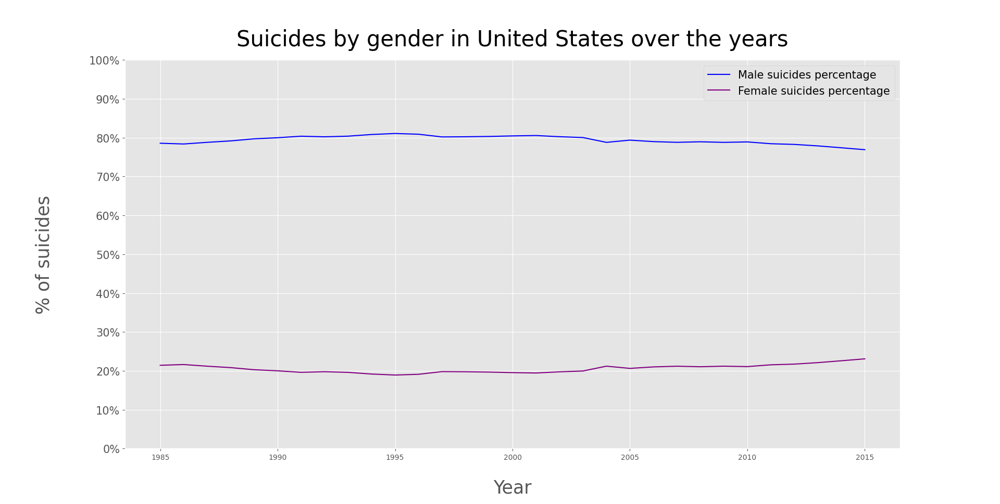

# Suicides by country

## Information
This project is a data visualization of various suicides information in several countries using Python and matplotlib.
The datasets contain data from 1985 to 2015 regarding more than 100 countries.
Source: https://www.kaggle.com/russellyates88/suicide-rates-overview-1985-to-2016, https://stats.oecd.org/Index.aspx?DataSetCode=POP_PROJ

## Screenshots
### United States
Data regarding US

### World
Data regarding 100+ countries

